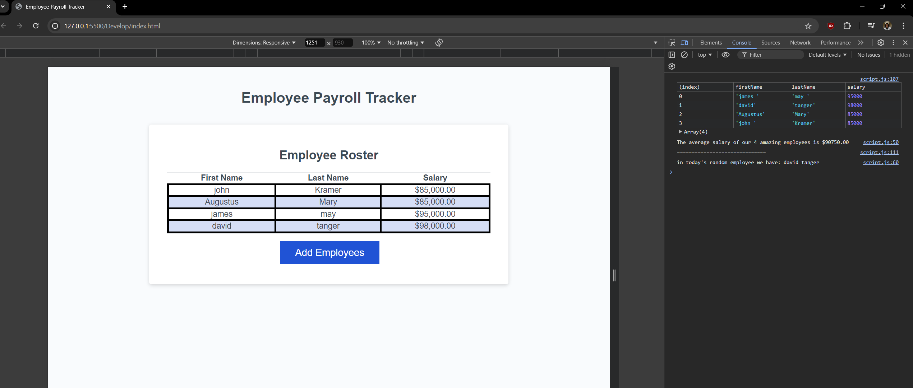

# Employee Payroll Tracker 
This Employee Payroll tracker has been created and modified to adhere to the functionality highlited on the below user story and acceptance criteria. 
This payroll tracker ensures that employee data can be correctly input, logged and displayed. 
It also console logs the employees average salary and can pick a random employee to be used for a random drawing or any other purpose. 
The mock up below demonstrates this functionality both on the console log and an animation of the website functionality 


## User Story

```
AS A payroll manager
I WANT AN employee payroll tracker
SO THAT I can see my employees' payroll data and properly budget for the company
```

## Acceptance Criteria

```
GIVEN an employee payroll tracker
WHEN I click the "Add employee" button
THEN I am presented with a series of prompts asking for first name, last name, and salary
WHEN I finish adding an employee
THEN I am prompted to continue or cancel
WHEN I choose to continue
THEN I am prompted to add a new employee
WHEN I choose to cancel
THEN my employee data is displayed on the page sorted alphabetically by last name, and the console shows computed and aggregated data
```

## Mock Up 

The below images show the web application's appearance and functionality" 


